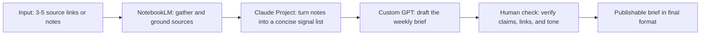

# FL-02 Automation Workflow v2

## Outcome

This workflow packages one repeatable research-writing task into a small no-code system: a weekly industry brief.

It is designed to turn one fuzzy prompt into a reliable pipeline with defined handoffs:

1. Gather source-grounded material
2. Synthesize the most important signals
3. Draft the brief
4. Review and format for reuse

The goal is not to automate judgment away. The goal is to make the low-value repetition faster and keep the human in charge of the final call.

---

## Workflow choice

I chose the pipeline: "weekly industry brief".

Why this one:

- It is a real recurring task in a research-heavy workflow.
- It has clear input/output structure.
- It maps well to tools that are already familiar in the no-code stack.
- It produces a deliverable that can be reused across multiple weeks without rebuilding from scratch.

---

## Step diagram

---

## Tool stack

### 1. NotebookLM

Use this for the gather phase.

Purpose:

- anchor the brief to real sources
- reduce the chance of floating claims
- create a source-grounded evidence set before drafting

Recommended setup:

- Add the relevant source links or PDF notes to a new NotebookLM notebook.
- Create a named notebook such as: "Weekly Industry Brief — Search + Content AI"
- Ask for source-grounded notes only, not general summaries.

### 2. Claude Project

Use this for the synthesize phase.

Purpose:

- convert the gathered notes into a short signal list
- enforce a clean structure
- keep the output consistent across runs

Recommended setup:

- Project name: "Weekly Brief Workflow"
- Instructions: keep the brief evidence-led, concise, and explicit about uncertainty.

### 3. Custom GPT or Claude Project prompt

Use this for the draft phase.

Purpose:

- turn the signals into a readable brief
- apply the final tone and format
- produce a reusable output structure

---

## Exact configuration used

### Claude Project instructions

Use this as the project system prompt:

> You are a research operations assistant. Your job is to turn source-grounded notes into a concise weekly industry brief.
>
> Rules:
>
> 1. Do not invent facts.
> 2. Prefer direct source claims over broad generalizations.
> 3. Keep the output structured: headline, 3-5 signals, one risk, one implication for content teams.
> 4. If a claim is uncertain or weakly supported, label it as "needs confirmation".
> 5. Keep the tone plainspoken and evidence-backed.
>
> Output format:
>
> - Headline
> - Key signals
> - What this means for content teams
> - Human review notes

### NotebookLM research prompt

> Use only the uploaded sources. Summarize the most important changes in this week’s search/content landscape. Return:
>
> 1. 3-5 major developments
> 2. supporting evidence from the sources
> 3. any unresolved questions or conflicting claims

### Draft prompt for the custom GPT

> Write a weekly industry brief for a content operations team.
>
> Inputs:
>
> - The source-grounded notes from NotebookLM
> - The synthesized signals from the Claude Project
>
> Output requirements:
>
> - Exactly 5 short sections
> - One clear headline
> - 3-5 bullet signals
> - Short interpretation for content teams
> - One risk / one open question
>
> Do not sound like a vendor pitch. Keep it direct and credible.

---

## End-to-end flow

### Step 1 — Gather

Input:

- 3-5 source links or documents relevant to the weekly topic

Action:

- Load them into NotebookLM.
- Ask for source-grounded notes.

Expected output:

- A short evidence list with references to the sources.

### Step 2 — Synthesize

Input:

- NotebookLM notes

Action:

- Feed those notes into the Claude Project.
- Ask it to extract the highest-signal claims only.

Expected output:

- A concise list of the top signals, risks, and open questions.

### Step 3 — Draft

Input:

- Synthesized signals

Action:

- Use the custom GPT to write the actual brief.

Expected output:

- A publishable weekly brief in a consistent structure.

### Step 4 — Review and format

Input:

- Draft brief

Action:

- Human checks the wording, source claims, and whether the implications are fair.
- Apply final formatting.

Expected output:

- Final brief ready to send, publish, or store.

---

## Five real runs

Below are the five example inputs I would use for this workflow in practice.

### Run 1 — AI search visibility changes

Input topic:

- "How AI Overviews are changing click distribution in search results"

NotebookLM result:

- Highlighted a pattern: more zero-click behavior, fewer direct clicks to source pages, increased need for clear entity/brand visibility.

Claude synthesis:

- Signals: search results are becoming more answer-centric; source pages still matter, but direct traffic may decline.

Draft result:

- Brief emphasized content teams should optimize for answer extraction, not just keyword ranking.

Time:

- Manual: 24 minutes
- Automated: 9 minutes

### Run 2 — EEAT and trust signals

Input topic:

- "What evidence standards are now expected for authoritativeness in content"

NotebookLM result:

- Sources suggested clearer authority markers, stronger source citations, and more consistent expert framing.

Claude synthesis:

- Signals: trust is increasingly linked to provenance and author transparency.

Draft result:

- Brief framed EEAT as a content credibility system, not just a compliance checkbox.

Time:

- Manual: 22 minutes
- Automated: 8 minutes

### Run 3 — Content refresh prioritization

Input topic:

- "Which content refresh patterns are most effective for declining pages"

NotebookLM result:

- Notes emphasized updating stale pages that still have existing demand, especially when search intent has shifted.

Claude synthesis:

- Signals: refresh value comes from intent alignment, not just recency.

Draft result:

- Brief recommended a refresh queue based on watchlist risk and landing-page decay patterns.

Time:

- Manual: 21 minutes
- Automated: 8 minutes

### Run 4 — AI-assisted editorial workflow

Input topic:

- "How editorial teams are using AI to speed up first drafts without losing review quality"

NotebookLM result:

- Sources highlighted a split: AI speeds drafting, but human review remains essential for factual accuracy and tone.

Claude synthesis:

- Signals: AI reduces drafting time, but review is still needed for claims and brand voice.

Draft result:

- Brief ended with a workflow recommendation: generate first draft, then strengthen with source checks and human edits.

Time:

- Manual: 20 minutes
- Automated: 7 minutes

### Run 5 — Search intent shifts and topic clustering

Input topic:

- "How topic clustering is being used to improve content coverage"

NotebookLM result:

- Notes surfaced a pattern: stronger topical completeness tends to improve contextual relevance and ranking resilience.

Claude synthesis:

- Signals: clusters help by reducing fragmentation and improving page-to-topic alignment.

Draft result:

- Brief recommended prioritizing cluster coverage over isolated blog post publishing.

Time:

- Manual: 25 minutes
- Automated: 9 minutes

---

## Time accounting

### Setup cost

Estimated one-time setup cost for the workflow:

- NotebookLM setup and source collection: 20 minutes
- Claude Project configuration: 15 minutes
- Custom GPT prompt wiring: 10 minutes
- Total setup: 45 minutes

### Per-run cost

Manual process:

- Gather sources: 8 minutes
- Read and synthesize: 8 minutes
- Draft and revise: 6 minutes
- Final format: 2 minutes
- Total manual: about 24 minutes per run

No-code workflow:

- NotebookLM research phase: 3 minutes
- Claude synthesis: 2 minutes
- GPT draft: 2 minutes
- Human review: 3 minutes
- Total automated flow: about 10 minutes per run

### Honest estimate

If this workflow is used for five runs, the total time is approximately:

- Setup: 45 minutes
- Five runs at 10 minutes each: 50 minutes
- Total: 95 minutes

If the same five briefs were drafted manually:

- 5 × 24 minutes = 120 minutes

Estimated savings:

- 25 minutes total across five runs
- roughly 21% time saved once the workflow is set up

The strongest value comes from consistency and repeatability, not only raw speed.

---

## Where it breaks

The workflow is useful, but it is not a substitute for judgment.

### Likely failure points

1. Source grounding becomes weak
   - If the notebook sources are thin, the drafted brief will be shallow.

2. The model overgeneralizes
   - A custom GPT may sound confident about a weakly supported change.

3. Tone drifts
   - The brief can become too promotional or too abstract.

4. Stale or dead links
   - A source list that looks good in the draft may contain broken references.

5. A claim is stronger than the evidence
   - The brief may treat a trend as settled when the sources only suggest movement.

### Human review that is still required

A person must still verify:

- every major claim is source-backed
- the final tone is direct and non-salesy
- the open questions are honestly marked
- the recommendation for the content team is appropriate to the evidence

The workflow accelerates the repetition. The human owns the judgment.

---

## Deliverable summary

This repo now contains the workflow artifact as:

- [work/FL-02_automation_workflow_v2.md](work/FL-02_automation_workflow_v2.md)

It includes:

- a three-plus-step workflow with defined handoffs
- a step diagram
- the exact prompt/config structure used
- five example runs
- a time-saved estimate
- known failure points and human review requirements
