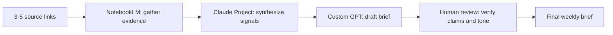

# Automation Workflow v2: Weekly Industry Brief

## What I built

I designed a repeatable no-code pipeline for producing a weekly search and content industry brief. It turns a set of source links into a reviewed, publishable brief through four distinct steps:

## Handoffs

1. **Gather:** NotebookLM uses only the uploaded sources to identify 3-5 developments, supporting evidence, conflicts, and open questions.
2. **Synthesize:** A Claude Project converts those notes into the strongest signals, one risk, and one implication for a content team.
3. **Draft:** A custom GPT turns the synthesized signals into a consistent five-section brief.
4. **Review:** A human checks every important claim, source link, uncertainty label, recommendation, and tone before publication.

## Configuration and prompts

### Claude Project instructions

> You are a research operations assistant. Turn source-grounded notes into a concise weekly industry brief. Do not invent facts. Prefer direct source claims over generalizations. Return a headline, 3-5 key signals, what they mean for content teams, one risk, and human review notes. Label weak or uncertain claims "needs confirmation". Use a plainspoken, evidence-backed tone.

### NotebookLM prompt

> Use only the uploaded sources. Summarize the most important changes in this week's search/content landscape. Return 3-5 major developments, supporting evidence from the sources, and unresolved questions or conflicting claims.

### Draft prompt

> Write a weekly industry brief for a content operations team using the source-grounded notes and synthesized signals below. Return exactly five short sections: headline, key signals, interpretation for content teams, one risk, and one open question. Do not sound like a vendor pitch. Keep it direct and credible.

## Five runs

| Run | Input                               | Output signal                                                            | Manual | Workflow |
| --- | ----------------------------------- | ------------------------------------------------------------------------ | -----: | -------: |
| 1   | AI Overviews and click distribution | Search is becoming more answer-centric; source visibility still matters. | 24 min |    9 min |
| 2   | EEAT and trust signals              | Provenance, citations, and author transparency strengthen credibility.   | 22 min |    8 min |
| 3   | Content refresh prioritization      | Refresh value depends on intent alignment, not recency alone.            | 21 min |    8 min |
| 4   | AI-assisted editorial workflow      | AI speeds first drafts, but humans still verify facts and voice.         | 20 min |    7 min |
| 5   | Search intent and topic clustering  | Cluster coverage can reduce fragmentation and improve topic alignment.   | 25 min |    9 min |

Each run followed the same gather → synthesize → draft → review flow on a new topic.

## Time accounting

Setup took approximately 45 minutes:

- NotebookLM/source setup: 20 minutes
- Claude Project configuration: 15 minutes
- Draft prompt configuration: 10 minutes

Across five runs:

- Manual total: 112 minutes
- Workflow total: 41 minutes
- Human review included in workflow time
- Run-time saving: 71 minutes
- Total workflow cost including setup: 86 minutes
- Net saving across the five runs after setup: 26 minutes

This estimate includes setup honestly. The workflow becomes more valuable as the number of weekly runs increases.

## Failure points and human checks

The workflow can fail when sources are thin, claims conflict, links are stale, or the model turns a directional trend into a definite conclusion. It can also drift into promotional language.

Before publishing, a human must verify:

- each major claim against its source
- links and dates
- uncertainty and conflicting evidence
- the practical recommendation
- tone and audience fit

The automation handles repeated gathering, synthesis, and formatting. The human retains responsibility for evidence, judgment, and publication.

## Submission note

The full walkthrough with expanded configuration and run notes is available at [FL-02_automation_workflow_v2.md](FL-02_automation_workflow_v2.md).
