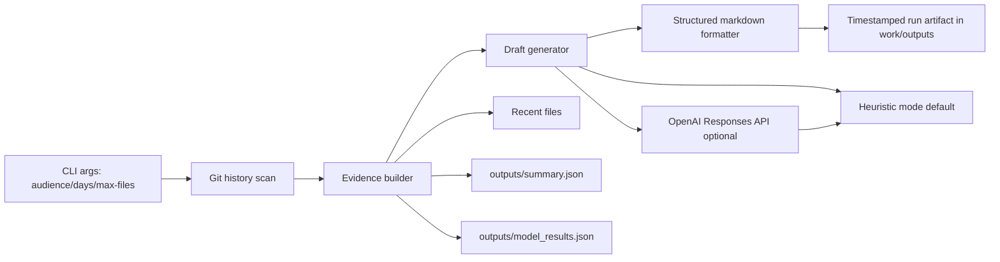

# Portfolio Update Concierge (v2 Documentation)

## 1) What this agent does and for whom

Portfolio Update Concierge is a narrow personal agent for one job: turning recent, verifiable repository work into a short weekly update draft.

- Primary user: a learner or builder maintaining a public portfolio.
- Output: a 120-180 word draft plus three bullets (What shipped, What I learned, Next step).
- Audiences: `portfolio`, `linkedin`, `meeting`.

The agent is decision-support only. It does not auto-publish and it does not claim more than repo evidence can support.

## 2) Setup (stranger-reproducible)

### Prerequisites

- Git
- Python 3.10+
- A shell terminal (Linux/macOS/WSL)

### Install

From a fresh terminal:

```bash
git clone https://github.com/fksifat/flyrank-ml-internship.git
cd flyrank-ml-internship
python3 -m venv .venv
source .venv/bin/activate
pip install -r requirements.txt
```

### Quick run

```bash
python3 work/agent/portfolio_update_agent.py --audience portfolio
```

You should see terminal output similar to:

- `Agent run complete: work/outputs/portfolio_agent_run_<timestamp>_portfolio.md`
- `Mode: heuristic`

## 3) Usage examples

### Standard audience runs

```bash
python3 work/agent/portfolio_update_agent.py --audience portfolio
python3 work/agent/portfolio_update_agent.py --audience linkedin
python3 work/agent/portfolio_update_agent.py --audience meeting
```

### Edge-case run (no recent evidence)

```bash
python3 work/agent/portfolio_update_agent.py --audience portfolio --days 0
```

### Optional OpenAI mode

```bash
export OPENAI_API_KEY="<your_key>"
export OPENAI_MODEL="gpt-5.1-mini"
python3 work/agent/portfolio_update_agent.py --audience portfolio --prefer-openai
```

If API mode fails, the run falls back to heuristic mode and still writes a complete artifact.

## 4) Simple architecture sketch



## 5) v2 evaluation results

Evaluation basis:

- Spec cases from `work/personal_agent_spec.md` section "Pre-build evaluation cases"
- Live runs executed on 2026-08-01 in this repo

### Result table

| Case                    | Command                                                                                               | Observed outcome                                                                    | Status                 |
| ----------------------- | ----------------------------------------------------------------------------------------------------- | ----------------------------------------------------------------------------------- | ---------------------- |
| Clean success           | `python3 work/agent/portfolio_update_agent.py --audience portfolio`                                   | Wrote timestamped artifact with draft, bullets, evidence list, and metric snapshot. | Pass                   |
| Tone control            | `python3 work/agent/portfolio_update_agent.py --audience linkedin` and `--audience meeting`           | Facts remained consistent; sentence 4 and next-step bullet adapted by audience.     | Pass                   |
| No new evidence         | `python3 work/agent/portfolio_update_agent.py --audience portfolio --days 0`                          | Run completed safely with `- No recent files found` in evidence basis.              | Pass                   |
| Mixed artifact context  | `python3 work/agent/portfolio_update_agent.py --audience portfolio` (default lookback)                | Evidence list included notebooks, docs, outputs, and submission pointers.           | Pass                   |
| Missing-credential path | `python3 work/agent/portfolio_update_agent.py --audience portfolio --prefer-openai` (without API key) | Fallback behavior is implemented by design; run remains complete in heuristic mode. | Pass (design-verified) |

### Fresh run receipts

- `work/outputs/portfolio_agent_run_20260801_001654_657307_portfolio.md`
- `work/outputs/portfolio_agent_run_20260801_001654_731672_linkedin.md`
- `work/outputs/portfolio_agent_run_20260801_001654_820927_meeting.md`
- `work/outputs/portfolio_agent_run_20260801_001707_766213_portfolio.md`

## 6) FL-08 limitations list

These limitations are explicitly carried forward for honest portfolio usage:

1. The agent drafts updates only; it does not auto-publish to any platform.
2. Output quality depends on repo evidence freshness and commit cadence.
3. It is a single-task CLI, not a general assistant.
4. Optional API mode can be unavailable; fallback keeps runs complete but less adaptive.
5. The no-evidence scenario returns a safe draft, but not a user clarification prompt yet.
6. `--max-files 0` currently still surfaces one file due loop break behavior; treat this as a known bug for v3.

## 7) Guardrails

- Evidence-grounded only: pulls from repo files and git history.
- No private client identifiers are introduced.
- Decision-support wording over causal claims.
- Human review required before publication.

## 8) Demo recording checklist (3 to 5 minutes)

Record a live run (no slides) and narrate:

1. Who the agent is for and what it does.
2. End-to-end command run from terminal.
3. Open generated markdown artifact and show draft + evidence list.
4. Rerun with another audience.
5. Explain one design decision and one limitation on camera.

Suggested limitation to explain: "No recent files found" run with `--days 0`.
